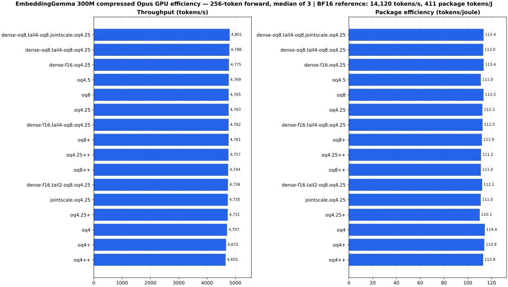

# EmbeddingGemma 300M AIE2P Opus Sweep

This directory is the AIE2P/NPU2-only benchmark slice for EmbeddingGemma 300M.
It keeps generated xclbins and model data out of the repo:

- xclbins/instruction binaries: `~/.hipfire/npu/`
- model/HFQ/calibration/Hessian artifacts: `~/.hipfire` or `/srv/huggingface`
- CSV results: `benchmarks/npu_gemm_tuning/results/`

The canonical model format names are `oq4++`, `oq8++`, and `oq4.25++`.
`oq4.25-policy` is reserved for the historical synthetic mixed-W4/W8 timing
policy; it is not an OQ4.25 model implementation.

## What This Measures

The sweep runs the EmbeddingGemma projection inventory as cache-width Opus GEMM
groups over the existing `hipfire-xdna::NpuGemmMp` dispatch path. W4 uses
K=256 groups; the dense W8 AIE2P path uses K=256 groups via `8x8x8` mmuls.

| shape | K | N | repeats |
|---|---:|---:|---:|
| q_proj | 768 | 768 | 24 |
| k_proj | 768 | 256 | 24 |
| v_proj | 768 | 256 | 24 |
| o_proj | 768 | 768 | 24 |
| gate_proj | 768 | 1152 | 24 |
| up_proj | 768 | 1152 | 24 |
| down_proj | 1152 | 768 | 24 |
| dense.0 | 768 | 3072 | 1 |
| dense.1 | 3072 | 768 | 1 |

`oq4++` maps to the packed-W4 AIE2P kernel. `oq8++` and the mixed
`oq4.25-policy` timing estimate require verified W8 caches. The dense W8
AIE2P attempt is intentionally kept separate because the useful `4x16x8` int8
matrix op expects sparse-B storage. The current W8 source uses dense `8x8x8`
mmuls, keeps W FIFO depth at 1 for the 16 KB slabs, and verifies full K=256
groups across all N slabs. The sweep can include multiple W8 `MT` heights and
selects the cache with the least batch padding, breaking ties toward fewer
dispatches. Whether it is faster than W4 is an empirical result from this sweep.

When W8 caches are present, `oq4.25-policy` uses W8 for sensitive attention/Dense
shapes and W4 for FFN bulk shapes. The benchmark reports per-shape latency and
weighted per-encode totals.

This is not a serving integration path. Runtime wiring should wait until this
sweep plus application-level EmbeddingGemma selection evidence justify it.

## Build

```bash
benchmarks/npu_gemm_tuning/embeddinggemma_aie2p/build_opus_caches.sh
```

The script builds W4 K=256 caches for `N={256,768,1152,3072}` using AIE2P
`r6_gen_mp.py` and writes them to `~/.hipfire/npu`.

The experimental W8 path is opt-in:

```bash
HIPFIRE_EMBGEMMA_NPU_BUILD_W8=1 \
  benchmarks/npu_gemm_tuning/embeddinggemma_aie2p/build_opus_caches.sh
```

Do not compare `oq8++` or `oq4.25-policy` until those W8 caches build and verify with
zero mismatches. The runner only includes W8 caches when each cache contains a
`VERIFIED` marker, unless `HIPFIRE_EMBGEMMA_NPU_ALLOW_UNVERIFIED_W8=1` is set for
an intentional experiment.

By default the W8 build emits only `MT=4`. Smaller `MT` values are verifier-clean
but measured pathologically slow in the timed sweep on this host. Override with
`HIPFIRE_EMBGEMMA_NPU_W8_MTS` only for experiments.

To mark a W8 cache as verified:

```bash
cargo run -p hipfire-xdna --example npu_gemm_mp_verify -- \
  ~/.hipfire/npu/embgemma_aie2p_w8_2x4x32_c8_nb4_m8k8_w8
touch ~/.hipfire/npu/embgemma_aie2p_w8_2x4x32_c8_nb4_m8k8_w8/VERIFIED
```

## Run

```bash
hipfire lock acquire embgemma-aie2p
benchmarks/npu_gemm_tuning/embeddinggemma_aie2p/run_opus_sweep.sh
hipfire lock release embgemma-aie2p
```

Useful overrides:

```bash
HIPFIRE_EMBGEMMA_NPU_BATCHES=32,128,512
HIPFIRE_EMBGEMMA_NPU_FORMATS=oq4++
HIPFIRE_EMBGEMMA_NPU_ITERS=20
HIPFIRE_NPU_CACHE_DIR=$HOME/.hipfire/npu
HIPFIRE_EMBGEMMA_NPU_ALLOW_UNVERIFIED_W8=0
```

## Quality Indicators

Mean cosine against BF16 is a vector-fidelity indicator, not a hard acceptance
threshold. Interpret it together with pair-score error and selection stability:
top-k overlap measures churn, while BF16-score regret measures whether changed
selections displaced a meaningfully better reference neighbor. Use the existing
`hipfire-arch-embeddinggemma` BF16 example as the reference and keep any HFQ or
calibration files outside the repo.

## Local AIE2P Result

On this host, the verified W8 `m8k8` path is useful only at larger batches with
the default `MT=4` caches:

| format | batch 32 ms | batch 128 ms | batch 512 ms |
|---|---:|---:|---:|
| `oq4++` | 77.853 | 69.250 | 259.033 |
| `oq8++` | 127.047 | 125.604 | 237.954 |
| `oq4.25-policy` | 96.422 | 90.855 | 247.656 |

The CSV is
`benchmarks/npu_gemm_tuning/results/embeddinggemma-aie2p-opus-w8m8-mt4.csv`.
`MT=1` and `MT=2` W8 caches verify correctly, but timed sweeps were
pathologically slow, so they are not default candidates.

Quality result, using the current W4A8 int4-roundtrip simulation against
BF16:

| doc | cosine |
|---:|---:|
| 0 | 0.95869 |
| 1 | 0.96097 |
| 2 | 0.94654 |

Mean cosine was `0.95540`. This is a high-drift operating point that needs
selection-level evaluation before it can be considered for embedding use. Log:
`~/.hipfire/eval-results/embeddinggemma-w4a8-quality-20260710T054926Z.log`.

## Generic Opus Runtime

`hipfire_xdna::NpuOpusGemmMp` implements one runtime contract for pure W4
(`qt=33/34`), compact mixed (`qt=36`), and pure W8 (`qt=35`) tensors. Plain,
`+`, and `++` artifacts use the same dispatch surface:

1. Decode each `[f16 scale][128 int4 nibbles][3 × (index, int8)]` group.
2. Run the int4 bulk through the verified AIE2P W4A8 cache.
3. Run `int8_replacement - int4_bulk` through the AIE2P sparse3 cache, fed as
   six bytes per output column instead of a dense 256-byte W8 column.
4. Add both integer outputs and apply activation/weight scales.
5. For `+` and `++`, divide activations by the optional AWQ sidecar before
   FWHT-256 and int8 activation quantization. `++` needs no separate runtime path.

The executor derives the sparse-overlay count from each compact block. Counts
larger than three are split across repeated sparse3 dispatches, so the public
path is not tied to one nominal bit width. Storage bits per weight are
`4.0625 + overlays/16`. Hardware parity currently covers:

| format | overlays/group | sparse dispatches | mismatches |
|---|---:|---:|---:|
| `oq4.125` | 1 | 1 | 0 |
| `oq4.25` | 3 | 1 | 0 |
| `oq4.375` | 5 | 2 | 0 |
| `oq4.5` | 7 | 3 | 0 |

The quantizer accepts any exactly representable mixed name from `oq4.125`
through `oq7.9375`, including `+` and `++` suffixes, and derives `--w8-top`
from that name. An explicitly conflicting `--w8-top` is rejected.

The W4, W8, and sparse kernels stay resident in separate hardware contexts.
Matrix K-group weights are uploaded into persistent XDNA buffers at pack/load
time, and the W4/W8 base commands are enqueued in order with one final timeline
wait. `NpuKernel` now
assigns each live kernel a distinct, firmware-safe fixed device-heap VA; this
fixes the previous overlapping-map corruption. Hardware parity is exact for
synthetic compact groups and real EmbeddingGemma q/K/FFN/Dense projection
tensors for all three suffix levels and every cache width.

```bash
cargo run --release -p hipfire-xdna --example npu_opus_verify -- \
  ~/.hipfire/npu/embgemma_aie2p_w4_4x4x16_c8_nb4 \
  ~/.hipfire/npu/embgemma_aie2p_w8_4x4x32_c8_nb4_m8k8_w8 \
  ~/.hipfire/npu/embgemma_aie2p_sparse3_4x4x16_c8_nb4_sparse3 \
  256 --encoding mixed --outliers 3 --awq
```

The sparse3 kernel vectorizes the three residual MACs across all 16 resident
rows using native int16 vectors while retaining int8 activation/residual
storage. A first int8-vector attempt compiled but corrupted 224/256 columns;
that unsupported 16-lane shape was rejected and is not retained. The int16
kernel passes exact synthetic and real-model parity.

`hipfire_arch_embeddinggemma::NpuOpusProjector` now wires all 24 layers through
three resident output-width executors. Q/K/V/O/gate/up use XDNA; attention,
norms, residuals, pooling, Dense heads, and non-Opus down-projection fallback
remain on GPU/host. This is a correctness-first hybrid path, not yet a serving
default.

On halo, a real layer-0 q-projection (`M=256, K=N=768`, `oq4.25++`) completed
the dense-W8 residual path in `8.018 ms`; sparse3 completed the same M=256
projection in `7.871 ms` with zero parity mismatches while cutting residual
weight feed from 256 to 6 bytes per output column. The
earlier context-reload workaround took `179.708 ms`; unique heap VAs removed
that setup cost.

End-to-end parity across three 16-18-token semantic probes passed for all suffix
levels:

| format | mean cosine | minimum cosine | max abs | GPU ms | hybrid ms |
|---|---:|---:|---:|---:|---:|
| `oq4.25` | 0.99992532 | 0.99992132 | 0.00154509 | 8.498 | 666.621 |
| `oq4.25+` | 0.99991894 | 0.99989808 | 0.00170707 | 9.212 | 682.507 |
| `oq4.25++` | 0.99992681 | 0.99991137 | 0.00153268 | 9.115 | 702.712 |
| `oq4.5` | 0.99991018 | 0.99989587 | 0.00166615 | 9.025 | 848.778 |

These are one-shot correctness measurements, not benchmark-grade latency. The
roughly 74-94x slowdown is expected from 144 synchronous GPU-to-host-to-NPU-to-
host-to-GPU projection crossings per encode, plus extra sparse dispatches for
wider mixed layouts. The next performance seam is
shared/zero-copy buffers or larger fused NPU regions; per-projection host copies
must not be promoted as a production serving path. Raw rows are in
`benchmarks/npu_gemm_tuning/results/embeddinggemma-aie2p-opus-mixed-hybrid-e2e.csv`.

The generated `EmbeddingGemma-300M--oq4.5.hfq` is `323.7 MB`. Its three-document
GPU-vs-BF16 mean cosine was `0.97441` (`0.97567`, `0.97435`, `0.97320`). This
shows substantial vector drift despite exact NPU/GPU runtime parity; broader
STS-B and selection evaluation answer different quality questions.

That broader 1,500-pair STS-B check confirms the distinction rather than
providing a binary verdict. Both mixed candidates are statistically tied with the
BF16 Spearman score, but their actual embedding vectors have only ~0.973 mean
cosine against BF16:

| format | embedding cosine mean | pair-score MAE | Spearman | delta CI95 |
|---|---:|---:|---:|---:|
| `oq4.25` | 0.972760 | 0.012481 | 0.862851 | [-0.000299, 0.003205] |
| `oq4.5` | 0.972873 | 0.012301 | 0.863219 | [-0.000010, 0.003439] |
| `oq8` | 0.999792 | 0.000929 | 0.861501 | [-0.000237, 0.000272] |

The small monotonic improvement from `oq4.25` to `oq4.5` shows that the extra
overlays are consumed; they are not being ignored by the variable-stride
loader. OQ8 uses the same FWHT sign/order contract and retains 0.99979 mean
embedding cosine, which argues strongly against a rotation-direction bug. The
mixed formats instead retain mostly W4 weight error while already sharing the
W8 activation path, so adding four sparse W8 weights per group has limited
effect. STS Spearman is rank-only and is too insensitive to certify vector
replacement fidelity here. Raw audit rows are in
`benchmarks/npu_gemm_tuning/results/embeddinggemma-opus-mixed-quality-audit.csv`.

## Mixed-Quality Improvement Sweep

The HFQ requantizer now accepts repeatable `--tensor-format 'GLOB=FORMAT'`
overrides. Later matches win, and the selected policy is embedded in HFQ
metadata. This provides a generic sensitivity-policy mechanism rather than an
EmbeddingGemma-specific keep-list.

| candidate | bytes | embedding cosine mean | p05 | pair MAE | Spearman |
|---|---:|---:|---:|---:|---:|
| uniform `oq4.25` | 321,050,112 | 0.972760 | 0.966121 | 0.012481 | 0.862851 |
| joint mixed-scale `oq4.25` | 321,050,112 | 0.976198 | 0.969711 | 0.010593 | 0.861605 |
| Dense F16 + `oq4.25` | 327,980,544 | 0.979208 | 0.972956 | 0.011289 | 0.862763 |
| Dense OQ8 + tail-4 OQ8 | 329,670,144 | 0.990626 | 0.986005 | 0.008575 | 0.862334 |
| Dense OQ8 + tail-4 OQ8 + joint scale | 329,670,144 | **0.992344** | **0.987834** | **0.007800** | 0.860453 |

All Spearman deltas remain statistically tied with BF16. The final policy moves
mean cosine from 0.972760 to 0.992344 for 8,620,032 extra bytes over uniform
`oq4.25`. Tail-two OQ8 measured 0.98825 on the three-document probe; tail-four
improved that operating point. Dense OQ8 was indistinguishable from Dense F16
in the tail-four policy while saving about 4.7 MB.

Joint mixed-scale fitting alternates sparse-overlay selection with scale refits
against the actual W4/W8 reconstruction objective. It improves plain OQ4.25
without changing storage and preserves NPU/GPU parity (mean 0.99991959, minimum
0.99990129). Quantization time increased from roughly 3 seconds to 19 seconds
for the uniform 300M candidate; this remains an offline cost. Raw rows are in
`benchmarks/npu_gemm_tuning/results/embeddinggemma-opus-mixed-quality-improvements.csv`.

## Selection-Stability Audit

To measure how vector noise affects an embedding index, the quality comparator
uses 256 STS-B `sentence1` embeddings as queries and all 1,500 `sentence2`
embeddings as the document pool. Candidate top-k results are compared with BF16.
Reference regret is the BF16 top-1 score minus the BF16 score of the document
selected by the candidate, so a near-tie flip is distinguished from replacing a
clearly better neighbor.

| candidate | top-1 agreement | changed | top-5 overlap | top-10 overlap | mean regret | changed-choice regret | max regret |
|---|---:|---:|---:|---:|---:|---:|---:|
| uniform `oq4.25` | 95.31% | 12/256 | 91.17% | 91.33% | 0.000538 | 0.011485 | 0.043456 |
| joint-scale `oq4.25` | 94.92% | 13/256 | 91.88% | 91.80% | 0.000487 | 0.009584 | 0.026684 |
| Dense OQ8 + tail-4 OQ8 + joint scale | 96.88% | 8/256 | 93.36% | 94.26% | 0.000122 | 0.003909 | 0.008313 |
| `oq8` | 99.22% | 2/256 | 98.98% | 98.83% | 0.000002 | 0.000238 | 0.000319 |

The BF16 mean top-1-to-top-2 margin is 0.085938. For uniform `oq4.25`, the
mean BF16 margin among changed selections is only 0.011485, showing that most
selection churn is concentrated in ambiguous neighborhoods. Joint scale lowers
regret and improves top-k overlap despite slightly lower exact top-1 agreement,
which is another reason not to use any single scalar as a cutoff. The hybrid
tail-four policy reduces mean regret by 77% versus uniform `oq4.25`; OQ8 remains
the near-reference endpoint.

This is a controlled selection-stability probe, not a labelled retrieval
benchmark: STS-B does not define every query's correct document among the pooled
sentence2 values. A deployment decision should repeat the same metrics on its
real corpus and add task labels such as recall@k or nDCG where available. Raw
rows are in
`benchmarks/npu_gemm_tuning/results/embeddinggemma-opus-mixed-selection-stability.csv`.

## GPU Throughput And Energy Sweep

The GPU sweep covers every local compressed EmbeddingGemma Opus artifact with
the same 256-token bidirectional embedding forward. Each artifact runs 30
forwards in three separate processes; the middle round reverses artifact order
to reduce thermal/order bias. Reported values are per-artifact medians. These
are input embedding tokens per second, not autoregressive decode tokens.



| operating point | median tokens/s | package tokens/J | package W |
|---|---:|---:|---:|
| compressed Opus range | 4,655–4,801 | 110.1–114.4 | 41.0–43.1 |
| fastest compressed: Dense OQ8 + tail-4 OQ8 + joint scale | 4,801 | 113.4 | 42.4 |
| most package-efficient compressed: `oq4` | 4,707 | 114.4 | 41.0 |
| BF16 reference | 14,120 | 410.7 | 34.3 |

The compressed formats are tightly clustered: only 3.1% separates their median
throughput extrema and 3.9% separates package-efficiency extrema. Differences
among plain, `+`, and `++` artifacts are therefore smaller than the current
structural gap to BF16. BF16 is 2.94x faster and 3.59x more package-efficient
than the best compressed result on this 300M, 256-token workload. Compression
does not currently translate into a GPU performance or energy win because the
Opus path consumes more package power while running slower; this points to the
prefill kernel/dispatch path rather than model bandwidth as the next target.

The `w4a8sim.oq4++` artifact is retained in the raw results but excluded from
the compressed chart: it is the same 654,448,128-byte size as BF16 and measures
like BF16, so it is a simulation control rather than a compressed Opus runtime
result. The local MedGemma 27B Opus artifact is also outside this chart because
it is a generative architecture and cannot be compared using the EmbeddingGemma
forward or token definition.

Package tokens/J uses the integrated GPU's `amdgpu power1_average` SoC package
rail. The raw CSV also records idle-subtracted dynamic tokens/J, but package
efficiency is the primary comparison because the short-process idle estimate
varied from run to run. Reproduce with:

```bash
benchmarks/npu_gemm_tuning/embeddinggemma_aie2p/run_gpu_energy_sweep.sh RAW.csv
python3 benchmarks/npu_gemm_tuning/embeddinggemma_aie2p/plot_gpu_energy.py \
  RAW.csv SUMMARY.csv CHART.svg
```

Results:

- `benchmarks/npu_gemm_tuning/results/embeddinggemma-opus-gpu-energy-20260710-raw.csv`
- `benchmarks/npu_gemm_tuning/results/embeddinggemma-opus-gpu-energy-20260710-summary.csv`
- `benchmarks/npu_gemm_tuning/results/embeddinggemma-opus-gpu-energy-20260710.svg`

## Resident-path bandwidth roofline (2026-07-12)

The completed 256-token resident trace averages 9.050 ms for attention and
13.603 ms for FFN across 24 layers. Their actual padded/duplicated packed weight
payloads are 8.192 MB and 12.190 MB per layer, giving only 0.905 and 0.896 GB/s
of payload throughput. R56 measures about 56.5 GB/s of aggregate external NPU
feed on the same host.

Even the conservative one-read-per-packed-byte calculation uses only about
1.6% of that roof. The resident model path is therefore not globally
memory-bandwidth limited: serialized dataflow, dispatch boundaries, local
stream/bank utilization, and preparation remain material. See
[`../../../docs/npu/npu-memory-bandwidth-cache-characterization.md`](../../../docs/npu/npu-memory-bandwidth-cache-characterization.md).
