# Repository Structure Cleanliness - 2026-07-06

This note is a compact map of how the repository fits together, plus a
structure-cleanliness assessment. It complements the deeper
[`architectural-review-2026-07-03.md`](architectural-review-2026-07-03.md),
which remains the detailed finding catalog and remediation roadmap.

## High-level Shape

hipfire is organized around a Rust workspace plus HIP kernel sources:

- `crates/` is the product: runtime, model-family implementations, serving,
  control-plane contracts, tools, eval harnesses, and backend crates.
- `kernels/src/` is the HIP source corpus consumed by the RDNA dispatch layer.
- `tests/` contains shell gates and smoke wrappers; GPU admission is still
  mostly gate-driven.
- `benchmarks/` holds prompt corpora, perf/quality baselines, tuning logs, and
  benchmark results.
- `docs/` is the active documentation set; `docs/plans/ARCHITECTURE-PLAN.md`
  is the canonical modularization decision record.
- `scripts/` contains reusable workflow glue and ad hoc operational tooling.
- `third_party/` vendors external references, experiments, and tooling such as
  graphify and AMD instruction calculators.
- `.agents/` contains repository-local agent skills and workflow procedures.
- `graphify-out/` is the generated codebase knowledge graph.

The workspace currently has a large number of crates, but the names are mostly
intentional and readable: backend crates (`hipfire-rdna`, `hipfire-cpu`,
`hipfire-npu`, `hipfire-xdna`, `hipfire-rocm`), control-plane crates
(`hipfire-model`, `hipfire-prompt`, `hipfire-state`, `hipfire-generate`,
`hipfire-scheduler`, `hipfire-config`), serving crates (`hipfire-serving-core`,
`hipfire-daemon`, `hipfire-server`, `hipfire-cli`), arch crates
(`hipfire-arch-*`), spec-decode crates (`hipfire-specdecode-*`), and offline
tooling crates (`hipfire-quantize`, `hipfire-coexistence`, `hipfire-gguf`,
`hipfire-eval`, `hipfire-atlas`).

## Dependency Map

```mermaid
flowchart TD
    subgraph UX["User-facing entrypoints"]
        CLI["hipfire-cli"]
        Server["hipfire-server"]
        Daemon["hipfire-daemon"]
        TUI["hipfire-tui"]
        WebUI["hipfire-*-ui crates"]
    end

    subgraph Serving["Serving and orchestration"]
        ServingCore["hipfire-serving-core"]
        Adapter["hipfire-daemon-adapter"]
        Protocol["hipfire-daemon-protocol"]
        Generate["hipfire-generate"]
        Scheduler["hipfire-scheduler"]
        State["hipfire-state"]
    end

    subgraph Contracts["Shared contracts and policy"]
        Model["hipfire-model"]
        Prompt["hipfire-prompt"]
        Config["hipfire-config"]
        Evidence["hipfire-evidence"]
        Hash["hipfire-hash"]
        Lock["hipfire-lock"]
    end

    subgraph Arch["Model-family implementations"]
        Archs["hipfire-arch-*"]
        ArchSpecs["hipfire-arch-*-spec"]
        ArchAPI["hipfire-arch-api / hipfire-archs"]
        SpecDecode["hipfire-specdecode-*"]
    end

    subgraph Runtime["Inference hot path"]
        RuntimeCore["hipfire-runtime"]
        RDNA["hipfire-rdna"]
        GPUTypes["hipfire-gpu-types"]
        QuantFormat["hipfire-quant-format"]
        KVQuant["hipfire-kvquant"]
        Kernels["kernels/src/*.hip"]
    end

    subgraph Backends["Backend and FFI floor"]
        HipBridge["hip-bridge"]
        HsaBridge["hsa-bridge"]
        CPU["hipfire-cpu"]
        NPU["hipfire-npu / hipfire-xdna"]
        ROCm["hipfire-rocm"]
    end

    subgraph Tooling["Offline tooling and evidence"]
        Quantize["hipfire-quantize"]
        Coexist["hipfire-coexistence"]
        GGUF["hipfire-gguf"]
        Eval["hipfire-eval"]
        Atlas["hipfire-atlas"]
        Benchmarks["benchmarks/"]
        Tests["tests/"]
        Scripts["scripts/"]
        Docs["docs/"]
    end

    CLI --> Server
    CLI --> Adapter
    Server --> Adapter
    Server --> Protocol
    Daemon --> ServingCore
    Daemon --> Protocol
    Daemon --> Lock
    Adapter --> Protocol

    ServingCore --> Archs
    ServingCore --> RuntimeCore
    ServingCore --> Generate
    ServingCore --> State
    ServingCore --> Model
    ServingCore --> Prompt
    ServingCore --> Evidence

    Generate --> Model
    Generate --> Prompt
    Scheduler --> Model
    Scheduler --> State
    Config --> Model
    Evidence --> Hash
    Eval --> Adapter
    Eval --> Evidence
    Eval --> Model

    Archs --> RuntimeCore
    Archs --> RDNA
    Archs --> SpecDecode
    Archs --> CPU
    Archs --> NPU
    ArchSpecs --> ArchAPI

    RuntimeCore --> RDNA
    RuntimeCore --> Model
    RuntimeCore --> Prompt
    RuntimeCore --> Generate
    RuntimeCore --> State
    RuntimeCore --> QuantFormat
    RuntimeCore --> KVQuant
    RDNA --> GPUTypes
    RDNA --> HipBridge
    RDNA --> Kernels
    HsaBridge --> HipBridge

    Quantize --> QuantFormat
    Quantize --> GGUF
    Coexist --> GGUF
    Atlas --> RDNA
    Tests --> Eval
    Benchmarks --> Eval
    Scripts --> Tests
    Docs -.documents.-> RuntimeCore
```

## What Is Clean

The top-level taxonomy is coherent. Source, kernels, tests, benchmarks,
documentation, scripts, third-party material, and agent workflows each have a
clear home.

The broad dependency direction is mostly understandable:

1. leaf contracts and FFI crates at the bottom,
2. RDNA/runtime compute above that,
3. model-family arch crates above runtime,
4. serving/daemon/CLI above model execution,
5. eval, quantization, coexistence, and atlas as offline or evidence tooling.

Several recent cleanups have moved the repo in the right direction:

- shared model/prompt/state/generate/evidence contracts are dedicated crates
  instead of being embedded in the daemon or runtime;
- `hipfire-rdna` has a clearer backend-crate name and uses leaf GPU type
  contracts;
- `hipfire-quant-format`, `hipfire-gguf`, `hipfire-cpu`, and
  `hipfire-diffusion-coexist` now own some responsibilities that were formerly
  duplicated or misplaced;
- the workspace has started using `[workspace.dependencies]` for common
  dependency declarations;
- active docs are separated from historical/planning material by convention.

## Cleanliness Problems

The main cleanliness issue is not top-level layout. It is concentration of
responsibility inside a few crates and files.

### 1. Monolithic Core Files

The detailed review identifies several very large compilation units:

- `hipfire-arch-qwen35/src/qwen35.rs`
- `hipfire-arch-qwen35/src/speculative.rs`
- `hipfire-arch-deepseek4/src/forward.rs`
- `hipfire-quantize/src/main.rs`
- `hipfire-diffusion/src/lib.rs`
- `hipfire-daemon/src/main.rs`
- `hipfire-serving-core` generate/load/session drivers
- `hipfire-rdna/src/dispatch/` as a large dispatch cluster

These files blur boundaries between pure planning logic, env policy, GPU
dispatch, per-model orchestration, and protocol handling. That makes ownership,
review, and targeted testing harder than the crate layout suggests.

### 2. Generic Logic Parked in Arch Crates

The arch crates are named as model-family implementations, but parts of them
contain generic serving, speculative decode, batching, quant, and transformer
machinery. The qwen35 crate is the clearest example: a meaningful part is
Qwen3.5-specific, but much of the surrounding decode/prefill/speculative
machinery wants a shared home.

This is the biggest structural mismatch: directory names imply model-specific
code, while file contents often contain reusable runtime infrastructure.

### 3. RDNA Dispatch Is Both Generic and Model-aware

`hipfire-rdna` is the generic HIP/RDNA compute backend, but it still contains
some model-family-specific dispatch surfaces. That keeps the hot path direct,
but it weakens the boundary between "generic GPU primitive" and "model-family
algorithm." A cleaner shape would keep reusable kernels and launch primitives in
`hipfire-rdna`, with model sequencing and private algorithm assembly in the
matching `hipfire-arch-*` crate.

### 4. Tests and Gates Are Structurally Split

`tests/` is well-labeled as enforcement wrappers and smoke gates, but important
quality evidence also lives in runtime examples, shell scripts, eval batteries,
and benchmark folders. That makes it easy to ask "what should I run?" and get
different answers depending on subsystem.

The intended direction is clear from repo guidance:

- no-GPU workflow checks: `./tests/no-gpu-ci.sh`;
- kernel/quant/dispatch/spec-decode correctness: `./tests/coherence-gate-dflash.sh`;
- model/runtime admission evidence: `hipfire-eval` batteries or suites.

The structure still reflects historical growth more than that clean target.

### 5. Documentation Is Better, But Still Heavy

`docs/README.md` establishes a clean split: `docs/` is active, historical work
belongs in archive links, and `docs/plans/ARCHITECTURE-PLAN.md` is the
modularization anchor. That is the right policy.

The practical issue is volume. There are many plans, reports, todos, and result
notes. The repo has good documentation, but navigation depends on knowing which
pages are canonical:

- start with `README.md` for product context;
- use `docs/OVERVIEW.md` for doc policy;
- use `docs/plans/ARCHITECTURE-PLAN.md` for current modularization state;
- use `docs/reference/STATUS.md` for drift/evidence coverage;
- use `docs/architectural-review-2026-07-03.md` for structural debt.

## Structural Cleanliness Verdict

The repo is clean at the macro layout level and messy at the high-traffic
implementation level.

The crate split is mostly pointing in the right direction. The biggest remaining
work is to make the contents match the names:

1. move generic transformer/spec-decode/batching machinery out of arch-specific
   files;
2. keep model-private orchestration out of the generic RDNA backend;
3. split large binaries and god modules into testable library seams;
4. continue turning shell/example QA into explicit eval batteries or tests;
5. keep offline conversion/import/coexistence tooling out of serving/runtime
   binaries.

The current structure is therefore workable but not yet calm. The boundaries are
visible, and recent refactors show the intended destination, but several core
files still behave like pre-modularization aggregation points.

## Suggested North Star

Use this ownership rule when adding or moving code:

| Code kind | Home |
|---|---|
| HIP kernel source | `kernels/src/` |
| HIP/RDNA launch primitive or reusable GPU op | `crates/hipfire-rdna/` |
| FFI to HIP/HSA | `crates/hip-bridge/`, `crates/hsa-bridge/` |
| model-family forward/load/state logic | matching `crates/hipfire-arch-*` |
| shared transformer, quant, KV, tokenizer, prompt, generation contracts | dedicated leaf/shared crates |
| daemon JSONL protocol | `crates/hipfire-daemon-protocol/` |
| daemon process client | `crates/hipfire-daemon-adapter/` |
| HTTP/API serving | `crates/hipfire-server/` and `crates/hipfire-serving-core/` |
| CLI frontend | `crates/hipfire-cli/` |
| import/export/conversion/interoperability | `crates/hipfire-coexistence/`, `crates/hipfire-gguf/`, or dedicated tooling crates |
| quantization pipeline | `crates/hipfire-quantize/` plus shared quant crates |
| runtime/model evidence | `crates/hipfire-eval/` and `crates/hipfire-evidence/` |
| smoke/enforcement wrappers | `tests/` |
| benchmark corpora/results | `benchmarks/` |
| active architecture decisions | `docs/plans/ARCHITECTURE-PLAN.md` and focused docs under `docs/` |

